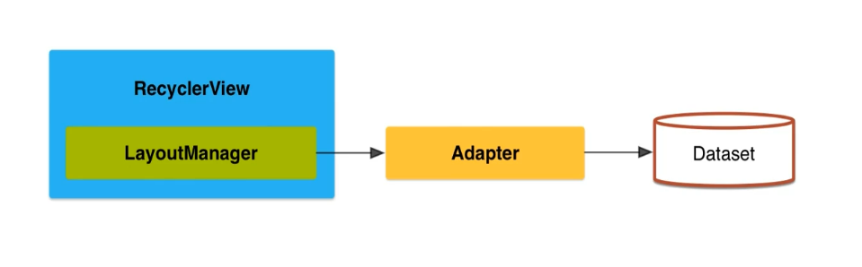

# Insights-Android
Arquivo destinado ao registro de aprendizado no desenvolvimento Android

## Anotação

Esse diagrama mostra o ciclo de vida de uma Activity em Android. Cada Activity no Android passa por uma série de estados durante sua existência, e o sistema Android chama métodos específicos à medida que a Activity transita entre esses estados. Aqui está uma explicação de cada etapa e dos métodos envolvidos:
1. onCreate()

    Descrição: Chamado quando a Activity é criada pela primeira vez.
    Uso: Aqui, você inicializa todos os componentes básicos da Activity, como criar layouts, instanciar variáveis e configurar a interface. É o ponto de partida do ciclo de vida.
    Próximo passo: onStart().

2. onStart()

    Descrição: Chamado quando a Activity está prestes a se tornar visível para o usuário.
    Uso: Pode ser usado para iniciar atualizações na interface ou configurações que você deseja mostrar imediatamente ao usuário.
    Próximo passo: onResume() se a Activity for trazida para o primeiro plano, ou onStop() se for coberta por outra Activity.

3. onResume()

    Descrição: Chamado quando a Activity começa a interagir com o usuário, tornando-se o foco principal.
    Uso: Ideal para iniciar animações, reprodução de áudio ou vídeo e outras interações com o usuário.
    Próximo passo: onPause() quando o usuário interrompe a interação (ex.: abre outra Activity ou aplicativo).

4. onPause()

    Descrição: Chamado quando a Activity está parcialmente visível, mas o usuário não está mais interagindo com ela (por exemplo, quando outra Activity é aberta em cima).
    Uso: Você deve pausar animações, vídeos, e outras ações que consomem muitos recursos, pois o usuário não está mais olhando para a tela.
    Próximo passo: onResume() se o usuário voltar para a Activity, ou onStop() se a Activity estiver completamente oculta.

5. onStop()

    Descrição: Chamado quando a Activity não está mais visível para o usuário.
    Uso: Ideal para liberar recursos intensivos que não são necessários enquanto a Activity está fora de vista (ex.: desconectar-se de um banco de dados).
    Próximo passo: onRestart() se o usuário retornar à Activity, ou onDestroy() se a Activity for encerrada.

6. onRestart()

    Descrição: Chamado quando a Activity é trazida de volta ao primeiro plano após ter sido parada.
    Uso: Útil para reconfigurar o que foi liberado em onStop() e preparar a Activity para o usuário novamente.
    Próximo passo: onStart().

7. onDestroy()

    Descrição: Chamado antes que a Activity seja completamente destruída e removida da memória.
    Uso: Aqui, você libera todos os recursos remanescentes e salva qualquer estado final, se necessário. Após onDestroy(), a Activity é finalizada.
    Próximo passo: A Activity é destruída e não existe mais na memória.

Resumo do Ciclo de Vida:

    Criar e iniciar: onCreate() → onStart() → onResume().
    Parar e reiniciar: onPause() → onStop() → onRestart() → onStart().
    Encerrar: onStop() → onDestroy().

Esse ciclo de vida permite que o Android gerencie os recursos de forma eficiente, garantindo que o aplicativo seja responsivo e eficiente no uso de memória e energia.

#######################################################################

## ANOTAÇÃO

O RecyclerView é um componente poderoso no Android para exibir listas de dados de maneira eficiente. Aqui está uma explicação detalhada dos componentes mostrados no diagrama:
1. RecyclerView

O RecyclerView é o contêiner principal para exibir uma grande quantidade de dados, como uma lista ou grade. Ele substitui o ListView e o GridView, pois é mais eficiente em termos de uso de memória e desempenho, especialmente para grandes conjuntos de dados.
2. LayoutManager

O LayoutManager é responsável por definir como os itens serão exibidos no RecyclerView:

    LinearLayoutManager: Exibe os itens em uma lista vertical ou horizontal.
    GridLayoutManager: Exibe os itens em uma grade com várias colunas.
    StaggeredGridLayoutManager: Exibe itens em uma grade com altura variável, ideal para layouts de mosaico.

3. Adapter

O Adapter é o intermediário entre o RecyclerView e o conjunto de dados (dataset). Ele:

    Cria as visualizações para cada item do RecyclerView.
    Preenche as visualizações com os dados corretos do dataset.
    Informa ao RecyclerView sobre mudanças nos dados para atualizar a interface.

4. Dataset

O Dataset é o conjunto de dados que você deseja exibir no RecyclerView. Pode ser uma lista de objetos, textos, imagens, etc. O Adapter acessa esse dataset para fornecer os dados necessários para cada item da lista.
Fluxo de Trabalho

    O RecyclerView solicita ao Adapter para fornecer os itens.
    O Adapter usa o Dataset para obter os dados e cria as visualizações.
    O LayoutManager organiza como as visualizações serão exibidas no RecyclerView.

O RecyclerView é altamente personalizável, permitindo animações, operações de arrastar e soltar, entre outras funcionalidades, tornando-o um componente essencial para listas em aplicativos Android.
